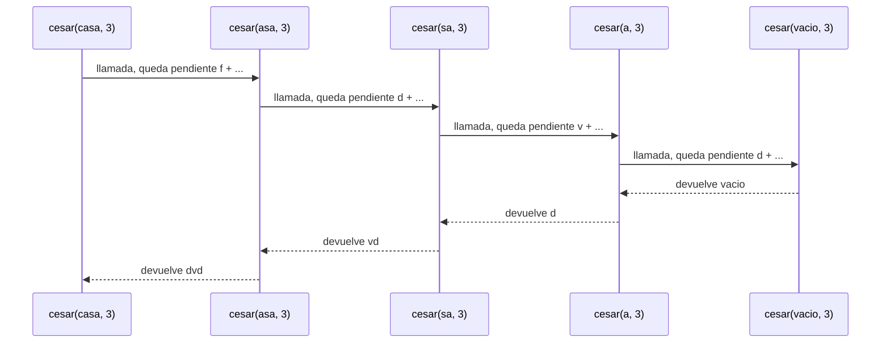
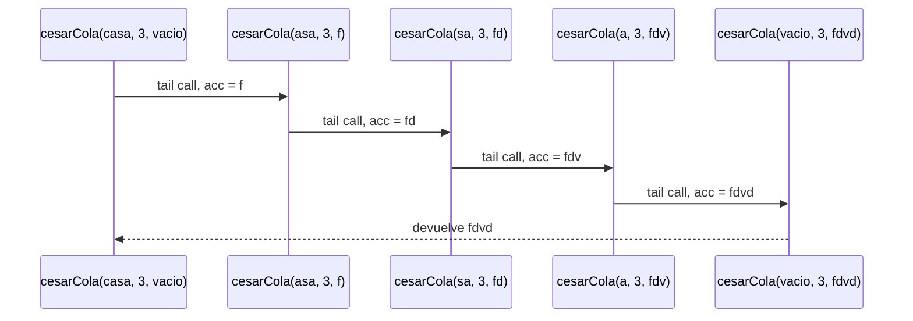

# Informe de proceso

## Puntos 1 y 2: cifrado César

Este informe muestra cómo se ejecutan `cesar` (recursión lineal) y `cesarCola`
(recursión de cola) con el mensaje `"casa"` y el desplazamiento `3`, con el
estado de la pila de llamados en cada paso.

### Cifrado de una letra

Las dos funciones usan la misma función auxiliar `desplazar`, que cifra una
sola letra. Si `p` es la posición de la letra (`a` = 0, ..., `z` = 25) y `k` el
desplazamiento, la nueva posición es

```math
p' = \big((p + k) \bmod 26 + 26\big) \bmod 26
```

El segundo `+ 26` y el segundo `mod` existen porque en Scala el operador `%`
puede devolver un valor negativo cuando `k < 0`. Así `p'` siempre queda entre 0
y 25. Lo que no es una letra minúscula (espacios, dígitos, signos, mayúsculas)
pasa sin cambio.

Para las letras de `"casa"` con `k = 3`:

| Letra | `p` | `p + k` | `p'` | Resultado |
|:-----:|:---:|:-------:|:----:|:---------:|
| `c`   | 2   | 5       | 5    | `f`       |
| `a`   | 0   | 3       | 3    | `d`       |
| `s`   | 18  | 21      | 21   | `v`       |
| `a`   | 0   | 3       | 3    | `d`       |

## Punto 1: `cesar` (recursión lineal)

```Scala
def cesar(m: Mensaje, k: Int): Mensaje = {
  def desplazar(c: Char): Char = ...
  if (m.isEmpty) ""
  else desplazar(m.head).toString + cesar(m.tail, k)
}
```

* **Caso base:** si el mensaje está vacío, el resultado es vacío.
* **Caso recursivo:** se cifra la primera letra y se **suma** (concatena) con
  el resultado de cifrar el resto.

La suma ocurre **después** de que vuelve la llamada recursiva. Por eso cada
llamada debe quedar esperando en la pila, guardando la letra ya cifrada que le
falta pegar.

### Ejecución de `cesar("casa", 3)`

Fase de **ida**: cada llamada cifra su primera letra y llama con el resto. La
pila crece una capa por letra, más una para el caso base.

| Paso | Llamada que se apila | Pila después del paso (de abajo hacia arriba) |
|:----:|----------------------|-----------------------------------------------|
| 1 | `cesar("casa", 3)` | `cesar("casa", 3)` espera `"f" + _` |
| 2 | `cesar("asa", 3)`  | `cesar("casa", 3)` espera `"f" + _`, `cesar("asa", 3)` espera `"d" + _` |
| 3 | `cesar("sa", 3)`   | las dos anteriores, `cesar("sa", 3)` espera `"v" + _` |
| 4 | `cesar("a", 3)`    | las tres anteriores, `cesar("a", 3)` espera `"d" + _` |
| 5 | `cesar("", 3)`     | las cuatro anteriores, `cesar("", 3)` (caso base) |

En el paso 5 la pila llega a su **altura máxima: 5 capas**.

Fase de **vuelta**: el caso base devuelve el texto vacío y cada capa, de arriba
hacia abajo, hace la suma que tenía pendiente y se libera.

| Paso | Capa que termina | Cálculo | Devuelve | Pila que queda |
|:----:|------------------|---------|:--------:|----------------|
| 6  | `cesar("", 3)`     | caso base    | `""`     | 4 capas |
| 7  | `cesar("a", 3)`    | `"d" + ""`   | `"d"`    | 3 capas |
| 8  | `cesar("sa", 3)`   | `"v" + "d"`  | `"vd"`   | 2 capas |
| 9  | `cesar("asa", 3)`  | `"d" + "vd"` | `"dvd"`  | 1 capa  |
| 10 | `cesar("casa", 3)` | `"f" + "dvd"`| `"fdvd"` | 0 capas |

### Diagrama de llamados de pila con recursión lineal



## Punto 2: `cesarCola` (recursión de cola)

```Scala
@tailrec
final def cesarCola(m: Mensaje, k: Int, acc: Mensaje = ""): Mensaje = {
  def desplazar(c: Char): Char = ...
  if (m.isEmpty) acc
  else cesarCola(m.tail, k, acc + desplazar(m.head))
}
```

* **Caso base:** si el mensaje está vacío, el resultado es `acc`.
* **Caso recursivo:** se cifra la primera letra, se agrega al acumulador `acc`
  y se llama con el resto.

La llamada recursiva es **lo último** que hace la función: no queda ninguna
operación pendiente después de ella. La anotación `@tailrec` le pide al
compilador que lo verifique y que convierta la recursión en un ciclo que
reutiliza la misma capa de la pila.

### Ejecución de `cesarCola("casa", 3)`

| Paso | Llamada | `m` | `acc` | Qué hace | Pila |
|:----:|---------|:---:|:-----:|----------|------|
| 1 | `cesarCola("casa", 3, "")` | `casa` | `""`   | cifra `c` y la agrega a `acc` | 1 capa |
| 2 | `cesarCola("asa", 3, "f")` | `asa`  | `f`    | cifra `a` y la agrega         | 1 capa |
| 3 | `cesarCola("sa", 3, "fd")` | `sa`   | `fd`   | cifra `s` y la agrega         | 1 capa |
| 4 | `cesarCola("a", 3, "fdv")` | `a`    | `fdv`  | cifra `a` y la agrega         | 1 capa |
| 5 | `cesarCola("", 3, "fdvd")` | vacío  | `fdvd` | caso base: devuelve `acc`     | 1 capa |

Resultado final: `"fdvd"`. La pila nunca pasa de **una capa**: en cada paso la
misma capa se reutiliza con nuevos valores de `m` y `acc`.

### Diagrama de llamados de pila con recursión de cola



A diferencia del diagrama del Punto 1, aquí no hay flechas de vuelta con
operaciones pendientes: cada llamada reemplaza a la anterior, y el resultado
sale directamente del caso base.

## Comparación: por qué una crece y la otra no

| Aspecto | `cesar` | `cesarCola` |
|---------|---------|-------------|
| Dónde se arma el resultado | Al **volver** de las llamadas | Al **ir**, dentro de `acc` |
| Operación pendiente tras la llamada | Sí: la concatenación `letra + _` | No |
| Capas de pila para `"casa"` | 5 | 1 |
| Capas de pila para $n$ letras | $n + 1$ | 1 |
| Espacio de pila | $O(n)$ | $O(1)$ |
| Mensajes muy largos | Puede desbordar la pila | No desbordan la pila |

* En **`cesar`** cada llamada debe guardar su letra ya cifrada, porque la
  necesita para la suma que hará cuando la llamada interna termine. Mientras
  espera, su capa no se puede liberar, así que la pila crece una capa por letra.
* En **`cesarCola`** lo que cada llamada necesitaría guardar ya viaja en `acc`,
  que es un parámetro. Al hacer la llamada recursiva no queda nada por hacer
  después, y por eso la capa actual se puede reutilizar. Es el proceso que
  haría un ciclo con una variable acumuladora, pero sin variables mutables ni
  `while`.

Esta diferencia es la que comprueba el test `"cesarCola: aguanta un mensaje
largo sin desbordar la pila"`, con un mensaje de 200 000 letras.
