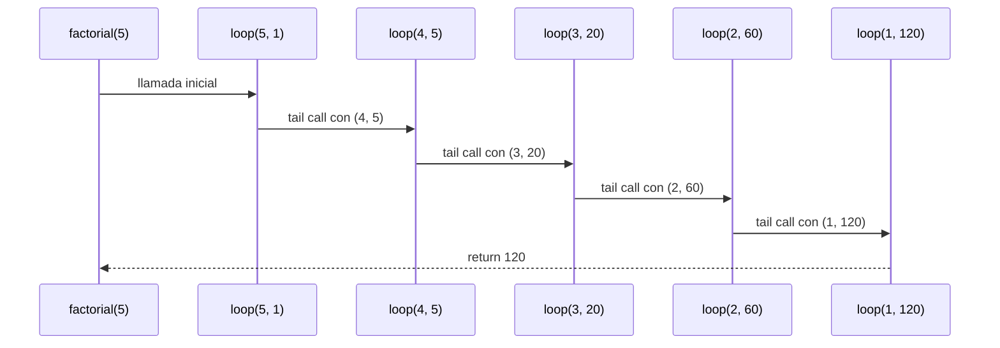
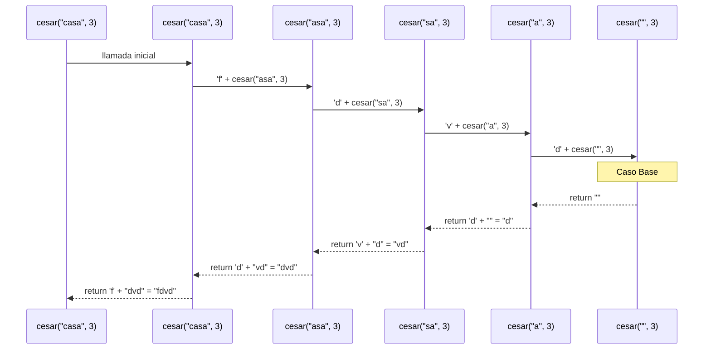

# Algoritmo Cesar con Recursión Lineal

### Tabla de Códigos ASCII (Minúsculas a-z)

| Letra | Código ASCII | Posición (0-25) |
| :---: | :----------: | :-------------: |
|   a   |      97      |        0        |
|   b   |      98      |        1        |
|   c   |      99      |        2        |
|   d   |     100      |        3        |
|   e   |     101      |        4        |
|   f   |     102      |        5        |
|   g   |     103      |        6        |
|   h   |     104      |        7        |
|   i   |     105      |        8        |
|   j   |     106      |        9        |
|   k   |     107      |       10        |
|   l   |     108      |       11        |
|   m   |     109      |       12        |
|   n   |     110      |       13        |
|   o   |     111      |       14        |
|   p   |     112      |       15        |
|   q   |     113      |       16        |
|   r   |     114      |       17        |
|   s   |     115      |       18        |
|   t   |     116      |       19        |
|   u   |     117      |       20        |
|   v   |     118      |       21        |
|   w   |     119      |       22        |
|   x   |     120      |       23        |
|   y   |     121      |       24        |
|   z   |     122      |       25        |
## Definición del Algoritmo

```Scala
def factorial(n: Int): BigInt = {
  @annotation.tailrec
  def loop(x: Int, acumulador: BigInt): BigInt = {
    if (x <= 1) acumulador
    else loop(x - 1, acumulador * x)
  }
  loop(n, 1)
}
```

* La función `factorial` calcula el factorial de un número `n` utilizando **recursión de cola**.
* La función interna `loop` es la que hace la recursión:

  * Recibe dos parámetros:

    * `x`: el valor actual decreciente hasta llegar a 1.
    * `acumulador`: donde se guarda el resultado parcial en cada paso.
* El decorador `@annotation.tailrec` obliga a que la función sea optimizada como recursión de cola, es decir, **no se acumulan llamados en la pila**.

## Explicación paso a paso

### Caso base

```Scala
if (x <= 1) acumulador
```

Cuando `x` llega a `1`, la función retorna directamente el valor acumulado, evitando más llamadas.

### Caso recursivo

```Scala
loop(x - 1, acumulador * x)
```

En cada llamada:

* Se reduce el valor de `x` en 1.
* Se multiplica el acumulador por `x` y se pasa a la siguiente iteración.
* Como es recursión de cola, la llamada recursiva es la **última instrucción** en ejecutarse, lo que permite a Scala optimizar la pila.

---

## Llamados de pila en recursión de cola

Ejemplo:

```Scala
factorial(5)
```

### Paso 1: Llamada inicial

```Scala
loop(5, 1)
```

### Paso 2: Primera iteración

```Scala
loop(4, 5)   // acumulador = 1 * 5
```

### Paso 3: Segunda iteración

```Scala
loop(3, 20)  // acumulador = 5 * 4
```

### Paso 4: Tercera iteración

```Scala
loop(2, 60)  // acumulador = 20 * 3
```

### Paso 5: Cuarta iteración

```Scala
loop(1, 120) // acumulador = 60 * 2
```

### Paso 6: Caso base

```Scala
return 120
```

---

## Diferencia con recursión normal

* En **recursión normal** cada llamada queda en la pila esperando a que termine la siguiente, lo que puede causar desbordamiento si `n` es muy grande.
* En **recursión de cola**, el compilador transforma el proceso en un **bucle optimizado**, por lo que no se guarda cada llamada en la pila y el algoritmo puede ejecutarse para valores muy grandes sin problema.

---

## Ejemplo de uso

```Scala
val resultado = factorial(5)
println(resultado)  // 120
```

El resultado de `factorial(5)` es `120`.


## Diagrama de llamados de pila con recursión de cola



```Scala
 def cesar(m: Mensaje, k: Int): Mensaje = {
     if(m.isEmpty){""}
     else {
       val c = m.head
       val charCifrado = if (c.isLetter && esMinuscula(c)) {
         (((c.toInt - primera + k) % 26 + letras) % 26 + primera).toChar
       } else {
         c
         }
       charCifrado + cesar(m.tail, k)
     }
  }
```

* la funcion `cesar` recorre toda la cadena carácter por carácter y aplica el cifrado César a las letras minúsculas. Los demás caracteres no cambian.
* Usa recursion lineal, cada llamada utiliza una llamada recursiva para procesar el resto de la cadena.
 * Recibe dos parametros:
   * `m`: es la cadena de texto o mensaje que se quiere cifrar.
   * `k`: es la clave que indica el numero de posiciones que se va a mover la letra.

## Explicación paso a paso
### Caso base

```Scala
 if(m.isEmpty){""}
```
Cuando m no tiene caracteres, devuelve una cadena vacia, se termina la recursion.

### Caso recursivo
Si la cadena no está vacia
```Scala
 val c = m.head
```
Se le asigna a c el primer carácter.

```Scala
 val charCifrado = if (c.isLetter && esMinuscula(c)) 
```
Se verifica que la cadena sea una letra y que sea minuscula  con `esMinuscula`, 
si cumple se asigna a `charCifrado` el resultado de lo que hay adentro de la condicion.

```Scala
 (((c.toInt - primera + k) % 26 + letras) % 26 + primera).toChar
```
* Según el codigo ASCII cada letra del mundo tiene un númeroasignado, 
  al hacer `c.toInt` se le dice que cambie `c` a 99 que es su número asignado.
  `primera` corresponde a  `a` con número 97. k es la clave, letras es el número de letras del abecedario.

  * `c.toInt - primera ` al restar el primer caracter menos la base
    el resultado da la posicion del caracter en nuestro abecedario, empezando desde 0.
  
  * `+ k`  aqui se aplica el cifrado sumando el número de posiciones que se va a mover según k.
    si  `k` es positiva avanza, si es negativa, retrocede.
  
  * si el resultado de `(c.toInt - primera + k)` es un numero mayor al numero de las letras del abecedario,
     se aplica `% 26`, el residuo de la division entre 26.
  
  * si es un número negativo, al hacer el módulo sigue siendo negativo y no hay posiciones negativas,
   se suma `+ letras`, la cantidad de letras del abecedario, a esa posicion negativa.
  
  * si el resultado de `(c.toInt - primera + k) % 26 ` es un número  positivo al sumar `+ letras`,
    se sale del rango letras, otra vez, entonces se vuelve aplicar `% 26`. Asi da un número entre 0-25.
  
  * Hasta aqui lleva la posicion exacta de la nueva letra.
  
  * `+ primera` se vuelve a sumar el codigo ASCII de la primera.
  
  * `.toChar` toma ese número  y lo muestra como el caracter que le corresponde.

## Llamados de pila en recursión lineal
Ejemplo:
### Paso 1: Llamada inicial

```Scala
cesar("casa", 3) 
```
### Paso 2: Primera iteración

```Scala
cesar("casa", 3) 
```
  * m no esta vacio. 
  * c= `c`
  * c es letra minuscula.
  * ((99 - 97 + 3) % 26 + 26) % 26 + 97 = 5 + 97 = 102 ('f'). 
  * 'f' + cesar("asa", 3), se queda esperando...

### Paso 3: Segunda iteración
```Scala
cesar("asa", 3) 
```
* m no está vacio.
* c= `a`
* c es letra minuscula.
* ((97 - 97 + 3) % 26 + 26) % 26 + 97 = 3 + 97 = 100 ('d').
* 'd' + cesar("sa", 3), se queda esperando...
* 'f' + ('d' + cesar("sa", 3)), se acomula en la pila.

### Paso 4: Tercera iteración
```Scala
cesar("sa", 3) 
```
* m no está vacio.
* c= `s`
* c es letra minuscula.
* ((115 - 97 + 3) % 26 + 26) % 26 + 97 = 21 + 97 = 118 ('v').
* 'v' + cesar("a", 3), se queda esperando...
* 'f' + 'd'+ ('v'+ cesar("a", 3)), se acomula en la pila.

### Paso 5: Cuarta iteración
```Scala
cesar("a", 3) 
```
* m no está vacio.
* c= `a`
* c es letra minuscula.
* ((97- 97 + 3) % 26 + 26) % 26 + 97 = 3 + 97 = 118 ('d').
* 'd' + cesar(" ", 3), se queda esperando...
* 'f' + 'd'+ 'v'('d'+ cesar(" ", 3)), se acomula en la pila.

### Paso 6: Caso base
```Scala
cesar(" ", 3) 
```
* m está vacio.
* devuelve " "

### Desapilado: Paso 6 al paso 5
* 'f' + 'd'+ 'v'('d'+ cesar(" ", 3)), esperaba ahora recibe " "
* 'f' + 'd'+ 'v'+('d'+ " ")
* resuelve ('d'+ " ") = 'd'

### Desapilado: Paso 5 al paso 4
* 'f' + 'd'+ ('v'+ cesar("a", 3)), esperaba ahora recibe 'd'
* 'f' + 'd'+ ('v'+ 'd')
* resuelve ('v'+ "d") = 'vd'

### Desapilado: Paso 4 al paso 3
* 'f' + ('d' + cesar("sa", 3)), esperaba ahora recibe 'vd'
*  'f' + ('d'+ "vd")
* resuelve ('d'+ "vd") = 'dvd'

### Desapilado: Paso 2 al paso 1
* 'f' + cesar("asa", 3), esperaba ahora recibe "dvd"
* 'f'+ 'dvd'
*  resuelve 'fdvd'

El resultado de cesar("casa", 3) es 'fdvd'

## Diagrama de llamados de pila con recursión de cola




# Algoritmo Cesar con Recursión en cola
 