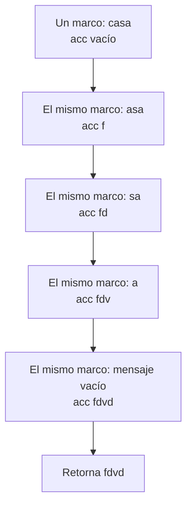
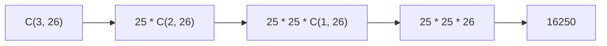

# Informe de proceso

## `cesar("casa", 3)`

La función cifra la primera letra y llama recursivamente sobre el resto. La
letra se transforma con la regla

$$
p' = (p + k) \bmod 26
$$

La pila crece porque cada llamada debe esperar para concatenar su letra al
resultado que devuelve la siguiente llamada.

```mermaid
sequenceDiagram
    participant I as Inicio
    participant C0 as cesar("casa", 3)
    participant C1 as cesar("asa", 3)
    participant C2 as cesar("sa", 3)
    participant C3 as cesar("a", 3)
    participant C4 as cesar("", 3)
    I->>C0: llamada
    Note over C0: pila: C0; espera concatenación
    C0->>C1: cifra c como f
    Note over C0,C1: pila: C0, C1
    C1->>C2: cifra a como d
    Note over C0,C2: pila: C0, C1, C2
    C2->>C3: cifra s como v
    Note over C0,C3: pila: C0, C1, C2, C3
    C3->>C4: cifra a como d
    Note over C0,C4: pila: C0, C1, C2, C3, C4
    C4-->>C3: ""
    C3-->>C2: "d"
    C2-->>C1: "vd"
    C1-->>C0: "dvd"
    C0-->>I: "fdvd"
```

Al retornar desde el caso base, se completan las concatenaciones pendientes:
`""`, `"d"`, `"vd"`, `"dvd"` y finalmente `"fdvd"`. Para un mensaje de
longitud $n$, esta versión mantiene hasta $n+1$ llamadas en la pila.

## `cesarCola("casa", 3)`

Esta versión lleva el resultado parcial en `acc`. En cada llamada consume la
primera letra, la cifra y la agrega al acumulador. El estado de la pila y el
acumulador evolucionan así:



En ejecución con optimización de cola, cada llamada reemplaza el marco
anterior; no se conservan todos esos marcos simultáneamente. La llamada
recursiva es la última operación y `@tailrec` permite al compilador verificar
esa propiedad. El acumulador guarda el trabajo parcial, por lo que al llegar
al mensaje vacío se devuelve directamente `"fdvd"`. Así, la pila de llamadas
se mantiene constante aunque el mensaje sea largo.

## Frecuencias y ruptura de César

Para `frecuencias("casa")`, el recorrido cuenta las apariciones de cada letra.
Al revisar `a`, la cuenta pasa de 0 a 1, luego a 2; `c` y `s` quedan con una
aparición. Después los pares se insertan en el orden requerido y el resultado
es `List(('a', 2), ('c', 1), ('s', 1))`. Los auxiliares avanzan con llamadas
de cola hasta terminar el mensaje o el alfabeto.

Con `desplazamientoProbable("hhhaa")`, el resultado ordenado empieza por
`('h', 3)`, así que se estima un desplazamiento de 3 desde `e` hasta `h`.
`romperCesar` pasa `-3` a `cesarCola` y recorre el texto cifrado hasta
devolver el texto descifrado.

## Combinaciones y Vigenère

Para `combinaciones(3, 26)`, las llamadas siguen la recurrencia hasta el caso
base:



Cada llamada reduce la longitud en uno; al llegar a longitud uno devuelve el
tamaño del alfabeto y las llamadas pendientes multiplican por 25.

En `vigenere("ataque", "sol")`, se cifra una letra y se avanza la clave:
`a` con `s` da `s`, `t` con `o` da `h`, `a` con `l` da `l`, y luego la clave
vuelve a `s`. La misma secuencia produce `shliip`. El auxiliar lleva el texto
restante, la posición de la clave y el acumulador; consume una letra por paso.
Si encuentra un espacio o un signo, lo agrega sin avanzar la clave.
