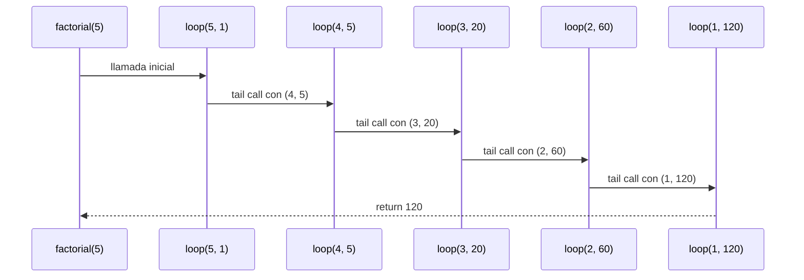
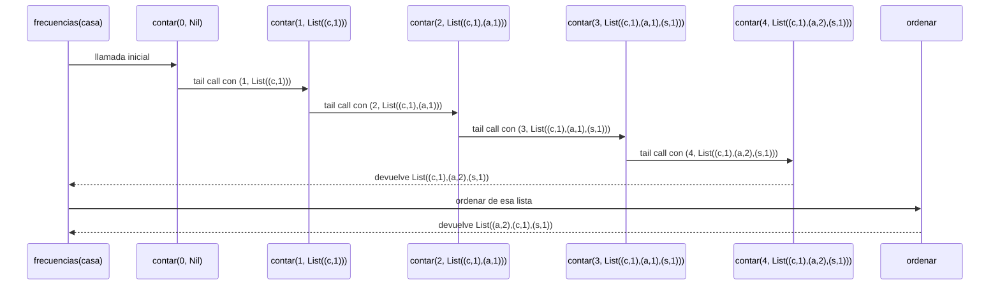
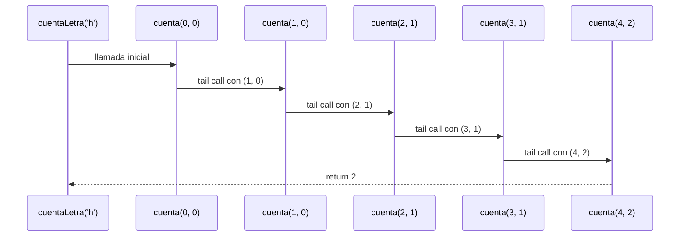
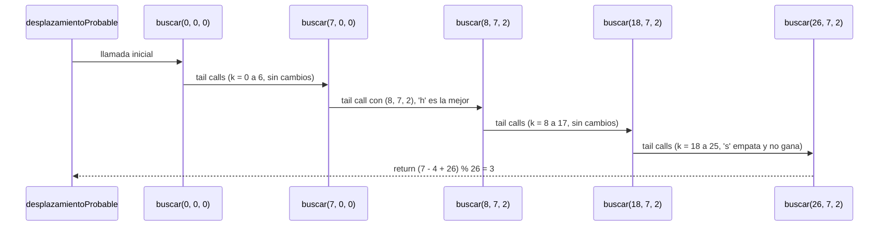

# Algoritmo Factorial con Recursión de Cola

## Definición del Algoritmo

```Scala
def factorial(n: Int): BigInt = {
  @annotation.tailrec
  def loop(x: Int, acumulador: BigInt): BigInt = {
    if (x <= 1) acumulador
    else loop(x - 1, acumulador * x)
  }
  loop(n, 1)
}
```

* La función `factorial` calcula el factorial de un número `n` utilizando **recursión de cola**.
* La función interna `loop` es la que hace la recursión:

  * Recibe dos parámetros:

    * `x`: el valor actual decreciente hasta llegar a 1.
    * `acumulador`: donde se guarda el resultado parcial en cada paso.
* El decorador `@annotation.tailrec` obliga a que la función sea optimizada como recursión de cola, es decir, **no se acumulan llamados en la pila**.

## Explicación paso a paso

### Caso base

```Scala
if (x <= 1) acumulador
```

Cuando `x` llega a `1`, la función retorna directamente el valor acumulado, evitando más llamadas.

### Caso recursivo

```Scala
loop(x - 1, acumulador * x)
```

En cada llamada:

* Se reduce el valor de `x` en 1.
* Se multiplica el acumulador por `x` y se pasa a la siguiente iteración.
* Como es recursión de cola, la llamada recursiva es la **última instrucción** en ejecutarse, lo que permite a Scala optimizar la pila.

---

## Llamados de pila en recursión de cola

Ejemplo:

```Scala
factorial(5)
```

### Paso 1: Llamada inicial

```Scala
loop(5, 1)
```

### Paso 2: Primera iteración

```Scala
loop(4, 5)   // acumulador = 1 * 5
```

### Paso 3: Segunda iteración

```Scala
loop(3, 20)  // acumulador = 5 * 4
```

### Paso 4: Tercera iteración

```Scala
loop(2, 60)  // acumulador = 20 * 3
```

### Paso 5: Cuarta iteración

```Scala
loop(1, 120) // acumulador = 60 * 2
```

### Paso 6: Caso base

```Scala
return 120
```

---

## Diferencia con recursión normal

* En **recursión normal** cada llamada queda en la pila esperando a que termine la siguiente, lo que puede causar desbordamiento si `n` es muy grande.
* En **recursión de cola**, el compilador transforma el proceso en un **bucle optimizado**, por lo que no se guarda cada llamada en la pila y el algoritmo puede ejecutarse para valores muy grandes sin problema.

---

## Ejemplo de uso

```Scala
val resultado = factorial(5)
println(resultado)  // 120
```

El resultado de `factorial(5)` es `120`.


## Diagrama de llamados de pila con recursión de cola


## A partir de acá, se hace el desarrollo del taller, lo anterior es el ejemplo que puso Cardel

# Algoritmo frecuencias con recursión de cola

## Definición del algoritmo

```Scala
def frecuencias(m: Mensaje): Frecuencias = {

  // Le suma 1 a la cuenta de la letra c; si c no estaba, la agrega con 1.
  def sumar(c: Char, l: Frecuencias): Frecuencias =
    l match {
      case Nil => List((c, 1))
      case (letra, cuenta) :: resto =>
        if (letra == c) (letra, cuenta + 1) :: resto
        else (letra, cuenta) :: sumar(c, resto)
    }

  // Cuenta las letras de m a partir de la posición i, con lo contado hasta ahí en acc.
  @tailrec
  def contar(i: Int, acc: Frecuencias): Frecuencias =
    if (i >= m.length) acc
    else if (esMinuscula(m(i))) contar(i + 1, sumar(m(i), acc))
    else contar(i + 1, acc)

  // Un par va antes que otro si tiene más cuenta, o igual cuenta y letra menor.
  def vaAntes(letra1: Char, cuenta1: Int, letra2: Char, cuenta2: Int): Boolean =
    cuenta1 > cuenta2 || (cuenta1 == cuenta2 && letra1 < letra2)

  // Mete el par (c, n) en la lista ya ordenada, en el lugar que le toca.
  def insertar(c: Char, n: Int, l: Frecuencias): Frecuencias =
    l match {
      case Nil => List((c, n))
      case (letra, cuenta) :: resto =>
        if (vaAntes(c, n, letra, cuenta)) (c, n) :: l
        else (letra, cuenta) :: insertar(c, n, resto)
    }

  // Ordena la lista insertando uno por uno sus elementos.
  def ordenar(l: Frecuencias): Frecuencias =
    l match {
      case Nil => Nil
      case (letra, cuenta) :: resto => insertar(letra, cuenta, ordenar(resto))
    }

  ordenar(contar(0, Nil))
}
```

* La función `frecuencias` recibe un mensaje y devuelve una lista de pares `(letra, cuenta)` con las letras minúsculas que aparecen, de la más frecuente a la menos frecuente. Si dos letras empatan, va primero la que viene antes en el alfabeto.
* El trabajo se reparte en cuatro funciones internas:

  * `sumar`: le suma 1 a la cuenta de una letra dentro de la lista. Si la letra todavía no estaba, la agrega con cuenta 1.
  * `contar`: recorre el mensaje de izquierda a derecha y va llamando a `sumar`. Es la función con recursión de cola y por eso lleva `@tailrec`.
  * `vaAntes`: dice si un par debe ir antes que otro (más cuenta, o igual cuenta y letra menor).
  * `insertar` y `ordenar`: dejan la lista final en el orden que pide el enunciado, insertando los pares de uno en uno.
* El mensaje puede ser tan largo como se quiera, pero la lista de pares nunca tiene más de 26 elementos, porque hay una sola entrada por letra.

## Explicación paso a paso

### Caso base de contar

```Scala
if (i >= m.length) acc
```

Cuando `i` llega a la longitud del mensaje ya no queda nada por leer, así que `contar` devuelve el acumulador tal cual. En ese momento `acc` tiene todas las cuentas, pero todavía sin ordenar.

### Caso recursivo de contar

```Scala
else if (esMinuscula(m(i))) contar(i + 1, sumar(m(i), acc))
else contar(i + 1, acc)
```

En cada llamada:

* Se mira el carácter de la posición `i`.
* Si es una letra minúscula, se actualiza el acumulador con `sumar` antes de llamar. Si no lo es (un espacio, un número, una mayúscula), el acumulador pasa igual.
* En los dos casos `i` avanza en 1.
* La llamada recursiva es lo último que se hace. La suma de la letra se resuelve antes de llamar y viaja dentro del parámetro `acc`, así que no queda nada pendiente cuando la llamada regrese.

### La función sumar

```Scala
def sumar(c: Char, l: Frecuencias): Frecuencias =
  l match {
    case Nil => List((c, 1))
    case (letra, cuenta) :: resto =>
      if (letra == c) (letra, cuenta + 1) :: resto
      else (letra, cuenta) :: sumar(c, resto)
  }
```

Va recorriendo la lista hasta encontrar la letra. Si la encuentra, le suma 1 y deja el resto como estaba. Si llega al final sin encontrarla, la agrega con cuenta 1. Esta función no es de cola (queda pendiente pegar el par de adelante), pero como la lista tiene máximo 26 pares, nunca apila más de 26 llamados.

### Las funciones vaAntes, insertar y ordenar

```Scala
def vaAntes(letra1: Char, cuenta1: Int, letra2: Char, cuenta2: Int): Boolean =
  cuenta1 > cuenta2 || (cuenta1 == cuenta2 && letra1 < letra2)
```

`insertar` recorre una lista que ya está ordenada y mete el par nuevo justo antes del primer elemento al que le gana según `vaAntes`. `ordenar` toma el primer par de la lista, ordena el resto y lo inserta. Igual que `sumar`, ninguna de las dos es de cola, y de nuevo trabajan sobre máximo 26 pares.

---

## Llamados de pila en frecuencias

Ejemplo:

```Scala
frecuencias("casa")
```

Primero se cuenta con `contar`.

### Paso 1: Llamada inicial

```Scala
contar(0, Nil)
```

### Paso 2: Primera iteración

```Scala
contar(1, List((c,1)))                 // lee c, no estaba: sumar la agrega
```

### Paso 3: Segunda iteración

```Scala
contar(2, List((c,1),(a,1)))           // lee a, no estaba: sumar la agrega
```

### Paso 4: Tercera iteración

```Scala
contar(3, List((c,1),(a,1),(s,1)))     // lee s, no estaba: sumar la agrega
```

### Paso 5: Cuarta iteración

```Scala
contar(4, List((c,1),(a,2),(s,1)))     // lee a, ya estaba: sumar sube su cuenta a 2
```

### Paso 6: Caso base

```Scala
List((c,1),(a,2),(s,1))                // i = 4 es la longitud, devuelve el acumulador
```

Así se ve por dentro el último `sumar`, el del paso 5:

```Scala
sumar(a, List((c,1),(a,1),(s,1)))
= (c,1) :: sumar(a, List((a,1),(s,1)))    // c no es a, sigue buscando
= (c,1) :: (a,2) :: List((s,1))           // encontró la a y le sumó 1
= List((c,1),(a,2),(s,1))
```

Después se ordena la lista que devolvió `contar`:

```Scala
ordenar(List((c,1),(a,2),(s,1)))
= insertar(c, 1, ordenar(List((a,2),(s,1))))
= insertar(c, 1, List((a,2),(s,1)))       // ordenar de las dos últimas ya dio List((a,2),(s,1))
```

Y se ubica la `c`:

```Scala
vaAntes(c, 1, a, 2)  // false: 1 no es mayor que 2, entonces sigue buscando
vaAntes(c, 1, s, 1)  // true: igual cuenta y c va antes que s, entonces se pone ahí
```

```Scala
List((a,2),(c,1),(s,1))
```

---

## Diferencia con recursión normal

* Si el recorrido del mensaje se hiciera con recursión normal, cada letra dejaría un llamado esperando en la pila, y con un mensaje muy largo se podría desbordar. Con `contar` eso no pasa: la llamada recursiva es la última instrucción, el compilador la convierte en un ciclo y siempre hay un único llamado en la pila, sin importar qué tan largo sea el mensaje.
* `sumar`, `insertar` y `ordenar` sí son recursión normal, pero recorren la lista de pares y no el mensaje. Como esa lista tiene máximo 26 elementos, su pila nunca pasa de 26 llamados, por muy grande que sea la entrada.

---

## Ejemplo de uso

```Scala
val resultado = frecuencias("casa")
println(resultado)  // List((a,2), (c,1), (s,1))
```

El resultado de `frecuencias("casa")` es `List((a,2), (c,1), (s,1))`.


## Diagrama de llamados de pila con recursión de cola



# Punto 4: Algoritmo para Romper el Cifrado César con Recursión de Cola (proceso)

## Definición del Algoritmo

```Scala
def desplazamientoProbable(m: Mensaje): Int = {
  def cuentaLetra(c: Char): Int = {
    @tailrec
    def cuenta(i: Int, acc: Int): Int =
      if (i >= m.length) acc
      else if (m(i) == c) cuenta(i + 1, acc + 1)
      else cuenta(i + 1, acc)

    cuenta(0, 0)
  }

  @tailrec
  def buscar(k: Int, kMejor: Int, cantMejor: Int): Int =
    if (k > 25) {
      if (cantMejor == 0) 0
      else (kMejor - 4 + 26) % 26
    }
    else {
      val n = cuentaLetra(('a' + k).toChar)
      if (n > cantMejor) buscar(k + 1, k, n)
      else buscar(k + 1, kMejor, cantMejor)
    }

  buscar(0, 0, 0)
}

def romperCesar(m: Mensaje): Mensaje =
  cesar(m, (26 - desplazamientoProbable(m)) % 26)
```

* La función `romperCesar` descifra un mensaje cifrado con el cifrado César sin conocer el desplazamiento. Para eso supone que la letra más frecuente del mensaje original era la **"e"**.
* La función `desplazamientoProbable` calcula cuántas posiciones se desplazó el mensaje, usando **recursión de cola** en sus dos funciones internas.
* La función interna `cuentaLetra` cuenta cuántas veces aparece una letra en el mensaje, con la función auxiliar `cuenta`:

  * Recibe dos parámetros:

    * `i`: la posición actual del mensaje, que crece hasta llegar al final.
    * `acc`: el acumulador donde se guarda el conteo parcial.
* La función interna `buscar` recorre las 26 letras del alfabeto para encontrar la más frecuente:

  * Recibe tres parámetros:

    * `k`: la letra que se va a revisar (`'a' + k`), de 0 a 25.
    * `kMejor`: la mejor letra encontrada hasta el momento.
    * `cantMejor`: cuántas veces aparece esa mejor letra.
* El decorador `@tailrec` obliga a que ambas funciones sean optimizadas como recursión de cola, es decir, **no se acumulan llamados en la pila**.

## Explicación paso a paso

### Función `cuenta`

#### Caso base

```Scala
if (i >= m.length) acc
```

Cuando `i` llega al final del mensaje, la función retorna directamente el conteo acumulado.

#### Caso recursivo

```Scala
else if (m(i) == c) cuenta(i + 1, acc + 1)
else cuenta(i + 1, acc)
```

En cada llamada:

* Se avanza una posición en el mensaje (`i + 1`).
* Si la letra en la posición `i` es la que se busca, se suma 1 al acumulador. Si no, el acumulador queda igual.
* Como la llamada recursiva es la **última instrucción** en ejecutarse, Scala puede optimizar la pila.

### Función `buscar`

#### Caso base

```Scala
if (k > 25) {
  if (cantMejor == 0) 0
  else (kMejor - 4 + 26) % 26
}
```

Cuando `k` pasa de 25 ya se revisó todo el alfabeto:

* Si `cantMejor` es 0, el mensaje no tiene letras y se retorna 0.
* Si no, se retorna `(kMejor - 4 + 26) % 26`. El 4 es la posición de la "e" (a = 0, b = 1, c = 2, d = 3, e = 4), así que restarlo indica cuánto se movió la "e" hasta la letra más frecuente. Se suma 26 y se toma módulo 26 para que el resultado nunca sea negativo.

#### Caso recursivo

```Scala
val n = cuentaLetra(('a' + k).toChar)
if (n > cantMejor) buscar(k + 1, k, n)
else buscar(k + 1, kMejor, cantMejor)
```

En cada llamada:

* Se cuenta cuántas veces aparece la letra `'a' + k`.
* Si aparece **más** veces que la mejor actual, esa letra pasa a ser la nueva mejor.
* Si no, se conserva la mejor anterior. Como se usa `>` estricto, en caso de empate se queda la primera letra.
* La llamada recursiva es la **última instrucción** en ejecutarse.

### Función `romperCesar`

Con el desplazamiento probable `d`, se aplica `cesar` con el desplazamiento **inverso** `(26 - d) % 26`, que devuelve el mensaje a su forma original.

---

## Llamados de pila en recursión de cola

Ejemplo: el mensaje original `"pepe"` fue cifrado con desplazamiento 3, y se obtuvo `"shsh"`.

```Scala
romperCesar("shsh")
```

### Paso 1: Llamada inicial

```Scala
desplazamientoProbable("shsh")  // inicia con buscar(0, 0, 0)
```

### Paso 2: Letras `'a'` a `'g'` (k = 0 a 6)

Ninguna aparece en el mensaje, así que `n = 0` y no supera a `cantMejor = 0`:

```Scala
buscar(0, 0, 0)
buscar(1, 0, 0)
...
buscar(7, 0, 0)   // k = 6 no cambia el estado
```

### Paso 3: Letra `'h'` (k = 7)

`cuentaLetra('h')` devuelve 2, y como `2 > 0` la letra `'h'` pasa a ser la mejor:

```Scala
buscar(7, 0, 0)   // n = 2 > 0
buscar(8, 7, 2)   // kMejor = 7, cantMejor = 2
```

### Paso 4: Letras `'i'` a `'r'` (k = 8 a 17)

Ninguna aparece, el estado no cambia:

```Scala
buscar(8, 7, 2)
...
buscar(18, 7, 2)
```

### Paso 5: Letra `'s'` (k = 18)

`cuentaLetra('s')` también devuelve 2, pero `2 > 2` es falso, así que se queda `'h'` (empate: gana la primera):

```Scala
buscar(18, 7, 2)  // n = 2, no es mayor que 2
buscar(19, 7, 2)
```

### Paso 6: Letras `'t'` a `'z'` (k = 19 a 25)

Ninguna aparece, el estado no cambia:

```Scala
buscar(19, 7, 2)
...
buscar(26, 7, 2)
```

### Paso 7: Caso base de `buscar`

```Scala
buscar(26, 7, 2)  // k > 25 y cantMejor != 0
return (7 - 4 + 26) % 26 = 29 % 26 = 3
```

### Paso 8: Descifrar

```Scala
cesar("shsh", (26 - 3) % 26)  // cesar("shsh", 23)
return "pepe"
```

### Cómo se calcula cada `cuentaLetra`

Por ejemplo, para `cuentaLetra('h')` sobre `"shsh"`:

```Scala
cuenta(0, 0)   // m(0) = 's' != 'h'
cuenta(1, 0)   // m(1) = 'h' == 'h', acc + 1
cuenta(2, 1)   // m(2) = 's' != 'h'
cuenta(3, 1)   // m(3) = 'h' == 'h', acc + 1
cuenta(4, 2)   // i >= m.length
return 2
```

---

## Diferencia con recursión normal

* En **recursión normal** cada llamada queda en la pila esperando a que termine la siguiente. Por ejemplo, al contar letras se tendría algo como `if (m(i) == c) 1 + cuenta(i + 1) else cuenta(i + 1)`, donde el `1 +` obliga a esperar la respuesta de la llamada interna, y con mensajes muy largos puede haber desbordamiento de pila.
* En **recursión de cola**, el acumulador (`acc`, `kMejor` y `cantMejor`) lleva el resultado parcial, así que la llamada recursiva es lo último que se hace. El compilador transforma el proceso en un **bucle optimizado**, por lo que no se guarda cada llamada en la pila y el algoritmo funciona con mensajes de cualquier tamaño.

---

## Ejemplo de uso

```Scala
val resultado = romperCesar("shsh")
println(resultado)  // pepe
```

El resultado de `romperCesar("shsh")` es `"pepe"`.

## Diagrama de llamados de pila con recursión de cola

### `cuentaLetra('h')` sobre `"shsh"`



### `buscar` sobre `"shsh"` (solo los pasos donde cambia el estado)



